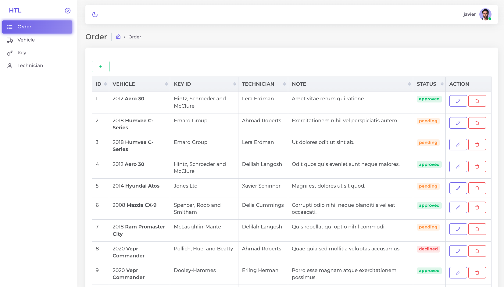

## HTL Admin
The problem to solve is the management of orders into our system. As a HTL admin, I want to be able to:
 - Create, update and delete an order
 - List orders by keys, vehicles, and technician
Keep in mind there is a relationship between keys and vehicles.
## Sign up

## Login

## Order

## Edit Order

## Command Steps
- Composer install
- create .env file
- php artisan key:generate
- sail build --no-cache
- sail up -d
- sail artisan migrate
- sail artisan db:seed
- npm start
- sail down -v
